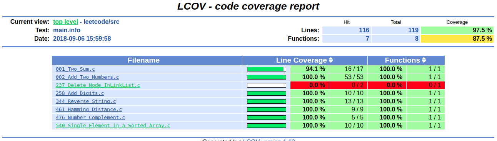

# LeetCodeWithC
the answers to the leetcode questions

[](https://github.com/yanbinghu/LeetCodeWithC)  [](https://github.com/yanbinghu/LeetCodeWithC)  [](https://github.com/yanbinghu/LeetCodeWithC)


# 如何运行？
下载源代码后，解压。
下载[lcov](http://ltp.sourceforge.net/coverage/lcov.php)
安装lcov make install。
完成后，运行./buildAndRun.sh即可，最后运行测试用例，生成覆盖率报告。

如果不想安装lcov或者不想生成覆盖率报告，则可以将
buidlAndRun.sh中的以下两句，前面加#注释掉
```
#lcov -c -o main.info -d .
#生成html
#genhtml main.info -o ./gcov
```


# 代码目录结构
```
├── gtest        //google test
├── leetcode     //source code
├── gcov    //coverage report
├── main         //run file
├── Makefile      // Make file 
├── README.md     //
├── buildAndRun.sh  //run shell
└── testcase      //test case file
```
# 覆盖率报告


# 题目总览
* [001_two_sum](#001_two_sum)
* [002_add_two_numbers](#002_add_two_numbers)
* [258_add_digits](#258_add_digits)
* [344_reverse_string](#344_reverse_string)
* [463_hamming_istance](#463_hamming_istance)
* [476_number_complement](#476_number_complement)

### 001_two_sum
##### 题目：
Given an array of integers, return indices of the two numbers such that they add up to a specific target.

You may assume that each input would have exactly one solution, and you may not use the same element twice.

Example:
Given nums = [2, 7, 11, 15], target = 9,

Because nums[0] + nums[1] = 2 + 7 = 9,
return [0, 1].
##### 释义：
给定整型数组，返回两个数的下标，使得这两个数相加得到特定的值。
假设每个给定的数组只能找到一组满足条件的结果，同时，不能使用同一个数两次。

##### 分析：
题大意为，在一组数组中，找到两个数，使得这两个数的和等于特定值，并返回下标。可以从第一个数开始，循环与后面的每一个相加，与结果比较，比较成功则返回。
例如，输入[1,7,11,15],目标值26，那么循环计算1+7,1+11,1+15，7+11,7+15......，直到得到目标值。
##### 代码地址如下：
[001 two sum](https://github.com/yanbinghu/LeetCodeWithC/blob/master/leetcode/src/001_Two_Sum.c)
### 002_add_two_numbers

#####  题目：
You are given two non-empty linked lists representing two non-negative integers. The digits are stored in reverse order and each of their nodes contain a single digit. Add the two numbers and return it as a linked list.

You may assume the two numbers do not contain any leading zero, except the number 0 itself.

Input: (2 -> 4 -> 3) + (5 -> 6 -> 4)
Output: 7 -> 0 -> 8

##### 释义：
给定两个非空链表代表两个非负整数，整数的各位数以逆序存储在链表的每个节点中。将这两个数相加，并返回结果链表。

##### 分析

题意较清晰，是将用链表形式的两个整数进行相加，并返回链表结果。
需要注意的主要有以下几点
1.加完之后需要给下一位子进位。
2.如果链表只有一位，直接计算结果，提高效率。
3.考虑两个链表长度不一样的场景

##### 代码地址如下：
[002 Add Two Numbers](https://github.com/yanbinghu/LeetCodeWithC/blob/master/leetcode/src/002_Add_Two_Numbers.c)
### 258_add_digits
##### 题目：
Given a non-negative integer num, repeatedly add all its digits until the result has only one digit.

For example:

Given num = 38, the process is like: 3 + 8 = 11, 1 + 1 = 2. Since 2 has only one digit, return it.

##### 释义：
计算各位数之和，直到最后只有一位。

##### 分析：
计算各位数之和，采用递归，计算一次后，再次调用，直到结果位各位数。

##### 代码地址如下：
[258 Add Digits](https://github.com/yanbinghu/LeetCodeWithC/blob/master/leetcode/src/258_Add_Digits.c)

### 344_reverse_string
##### 题目：
Write a function that takes a string as input and returns the string reversed.

Example:
Given s = "hello", return "olleh".
##### 释义：
字符串翻转
##### 分析
头尾对应位置的字符位置调换

##### 代码地址如下：
[344 Reverse String](https://github.com/yanbinghu/LeetCodeWithC/blob/master/leetcode/src/344_Reverse_String.c)

### 463_hamming_istance
##### 题目：
The Hamming distance between two integers is the number of positions at which the corresponding bits are different.

Given two integers x and y, calculate the Hamming distance.

Note:
0 ≤ x, y < 231.

Example:

Input: x = 1, y = 4

Output: 2

Explanation:
1   (0 0 0 1)
4   (0 1 0 0)
       ?   ?

The above arrows point to positions where the corresponding bits are different.

##### 释义：

##### 分析：
两个数的汉明距离，可以理解为，二进制的情况下，两个数异或之后的数的1的个数。
比如例子中，1和4,0001与0100异或得：0101，而0101中1的个数，即为汉明距离，可以理解位，从0001，变成0100，需要改变的位数。
##### 代码地址如下：
[463 Hamming Distance](https://github.com/yanbinghu/LeetCodeWithC/blob/master/leetcode/src/461_Hamming_Distance.c)


### 476_number_complement

##### 题目：
Given a positive integer, output its complement number. The complement strategy is to flip the bits of its binary representation.

Note:
The given integer is guaranteed to fit within the range of a 32-bit signed integer.
You could assume no leading zero bit in the integer’s binary representation.
Input: 5
Output: 2
Explanation: The binary representation of 5 is 101 (no leading zero bits), and its complement is 010. So you need to output 2.

##### 释义：
给定一个正整数，输出它的补全整数。补全策略是翻转它的每个比特位，得到补全整数。

##### 分析：

对于补全，以5为例，101，每一位翻转得到，010，即结果为2，那么，010+101 = 111，2的3次方。再以35为例，10 0011，翻转得到011100，即有100011+011100=111111,2的6次方，那么不难得到，其实补全数，就是用2的n次方，减去该数，其中，n为该数二进制表示的位数。

##### 代码地址如下：
[476 Number Complement](https://github.com/yanbinghu/LeetCodeWithC/blob/master/leetcode/src/476_Number_Complement.c)
